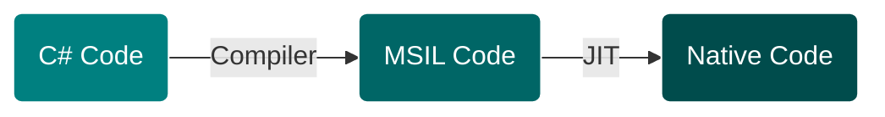

# Demo of Expression Class

>Expression trees represent code in a tree-like data structure, where each node is an expression, for example, a method call or a binary operation such as x < y.

>You can compile and run code represented by expression trees. This enables dynamic modification of executable code, the execution of LINQ queries in various databases, and the creation of dynamic queries.

>Expression trees are also used in the dynamic language runtime (DLR) to provide interoperability between dynamic languages and .NET and to enable compiler writers to emit expression trees instead of Microsoft intermediate language (MSIL).
---
## Expression Trees from Lambda Expressions
`Expression<Func<int, bool>> lambda = num => num < 5;`
## Expression Trees by Using the API
```csharp
ParameterExpression numParam = Expression.Parameter(typeof(int), "num");  
ConstantExpression five = Expression.Constant(5, typeof(int));  
BinaryExpression numLessThanFive = Expression.LessThan(numParam, five);  
Expression<Func<int, bool>> lambda1 =  
    Expression.Lambda<Func<int, bool>>(  
        numLessThanFive,  
        new ParameterExpression[] { numParam });  
```
---
## Code Transformation


---
* Links
  - [Expression Trees (C#)](https://learn.microsoft.com/en-us/dotnet/csharp/programming-guide/concepts/expression-trees/)